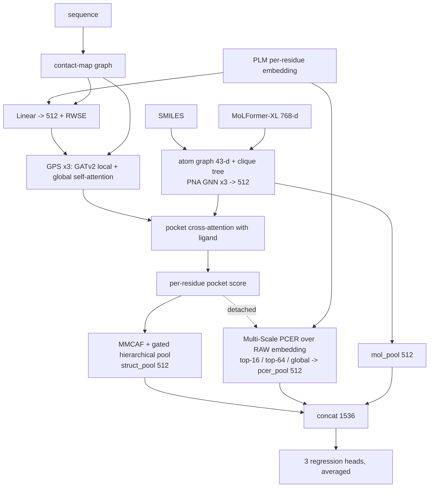

# TRACE-Kin
Graph neural network for predicting enzyme kinetic parameters (Km, kcat, Ki, Kd, kcat/Km) from protein sequence and ligand SMILES. The v7 architecture couples a GATv2 + global-attention structure stream to uncompressed protein-language-model embeddings via pocket-conditioned readout. Adapted from PSICHIC.

# TRACE-Kin — Kinetic Parameter Prediction Backbone

Predicts enzyme kinetic parameters — **Km, kcat, Ki, Kd, kcat/Km** — from a protein sequence and a ligand SMILES, using a dual-stream graph neural network with drug–protein cross-attention.

TRACE-Kin is the kinetic-prediction backbone of **TRACE** (Transformative Reasoning Across Catalytic Enzymes), a graph-to-reasoning framework for enzymatic drug discovery. The architecture is adapted from [PSICHIC](https://www.nature.com/articles/s42256-024-00847-1) (Koh et al., *Nature Machine Intelligence*, 2024) — see [Attribution](#attribution).

> **Status: active research.** The current architecture is **v7 (Structure-Guided Embedding Distillation)** — see [Architecture](#architecture--v7-current). `v1` is a frozen PSICHIC-derived baseline that produced the historical 1,847-row benchmark; `v4`–`v6c` are earlier redesigns kept runnable for ablation. All of them target one documented gap: Random Forest on mean-pooled protein embeddings outperforms the v1 GNN on catalytic kinetics. A redesign is promoted to paper figures only when [`analysis/promotion_gate.py`](analysis/promotion_gate.py) passes.

---

## What it produces

Three artifacts, all consumed by downstream TRACE components:

| Artifact | Where | Used for |
|---|---|---|
| **Kinetic predictions** | `test_prediction_seed<N>.csv` | benchmark RMSE; feasibility gating |
| **Drug-atom ↔ protein-residue cross-attention** | `interpretation_result_seed<N>/` | sites of metabolism; physical evidence for reasoning traces |
| **Per-pair interaction fingerprints** | same, `fingerprint.npy` | ranking enzyme/substrate combinations |

---

## Architecture — v7 (current)

**Structure-Guided Embedding Distillation (SGED).** Implemented in [`models/trace_kin/net_v7.py`](models/trace_kin/net_v7.py), configured by [`training/config_v7.json`](training/config_v7.json).

The central idea is **Pocket-Conditioned Embedding Readout (PCER)**: a structural stream decides *where* on the protein to read, while a separate embedding stream supplies *what* is read — at full, uncompressed PLM width. The two streams **share no parameters**; they are coupled only through attention weights, and that coupling is detached, so each trains against its own path.



### Structure stream (`d_model = 512`)

| Component | Detail |
|---|---|
| Input projection | `Linear(prot_evo_channels → 512)` + LayerNorm |
| Positional encoding | **RWSE** — random-walk landing probabilities over 16 hops of the contact graph, projected to 512 and added |
| Encoder | **3 × GPS layer**, each = `GATv2Conv` local message-passing (8 heads, RBF-embedded edge weights) **+** global multi-head self-attention (8 heads) **+** FFN(512→1024→512, GELU), LayerNorm residuals, gradient-checkpointed |
| Pocket identification | cross-attention (protein queries, ligand atom keys) → per-residue `pocket_score`; **top-64** residues form the pocket |
| MMCAF | bidirectional cross-attention: pocket ← ligand and ligand ← pocket |
| Pooling | attention pool over pocket **and** over the full protein, fused by a learned sigmoid gate |

The GPS design is deliberate: GATv2 respects contact-graph topology (local, sparse, interpretable edges), while the global self-attention captures long-range allosteric coupling that the graph cannot express.

### Embedding stream (raw width, never compressed during aggregation)

| Component | Detail |
|---|---|
| Normalization | LayerNorm over the full `prot_evo_channels` |
| Mutation-aware gate | per-residue `Linear(C→256)→ReLU→Linear(256→1)→sigmoid`, modulating the pocket score — exploits mutation-sensitive PLM training signal |
| **Multi-Scale PCER** | the (detached) pocket score becomes softmax readout weights over the **raw** per-residue embedding at three scales — **catalytic (top-16)**, **pocket (top-64)**, **global (all residues)** — each compressed independently `C→1024→512`, then combined by a learned 3-way softmax gate |
| Auxiliary loss | `emb_decoder` reconstructs the mean-pooled raw embedding from `pcer_pool` (MSE × 0.1), forcing PCER to preserve information |

### Head

`concat[mol_pool, struct_pool, pcer_pool]` = **1536-d** interaction fingerprint → an **ensemble of 3 regression heads** `MLP([1536, 512, 256, 1])`, averaged for variance reduction.

### Why this design

The redesign targets three documented reasons Random Forest on mean-pooled embeddings beats the v1 GNN on catalytic kinetics:

1. **Information bottleneck.** v1 projects the PLM embedding to 200-d *before* fusion, destroying signal that RF keeps. PCER never compresses during aggregation — it reads out over the full-width embedding, so the model gets RF's information with structural focus on top.
2. **MinCut loss misalignment.** v1's clustering objective fought kinetic prediction. v7 drops MinCut entirely; its only auxiliary term is embedding reconstruction, which *supports* the primary objective.
3. **Self-derived graph noise.** The graph now only *weights* the readout rather than carrying the features, so contact-map noise has less leverage — and `--contact_source esmc` lets you swap in a stronger contact head (see below).

### ⚠ v7 requires **per-residue** embeddings

If `--feature_col` holds one pooled vector per protein, it is broadcast identically to every residue — and PCER becomes **degenerate**: the top-16, top-64 and global scales all pool identical vectors, so the three scales carry the same information no matter how good the pocket scores are. Use `--embedding_source esmc` (per-residue by construction) or a per-residue `(L, C)` feature column. Verify:

```python
t = torch.load('<datafolder>/protein.pt')
k = next(iter(t)); print(t[k]['token_representation'].float().std(0).mean())   # must be > 0
```

### Interpretability outputs

Beyond the shared cross-attention artifacts, v7 exposes `pocket_score`, `pocket_mask`, `struct_gate`, `scale_weights` (which of the three PCER scales the model relied on), `pcer_score`, the MMCAF attention maps and the per-layer GATv2 edge attentions.

### Key hyperparameters

`d_model` 512 · GPS layers 3 · GATv2 heads 8 · global heads 8 · RWSE steps 16 · `pocket_k` 64 · PCER scales 16/64/all · prediction heads 3 · `emb_recon_weight` 0.1 · dropout 0.1 · LR 3e-4 with 500-step warmup + cosine decay · AdamW wd 0.01 · patience 25.

---

### Version lineage

Earlier versions remain runnable via `--model_version` for ablation and reproduction. Each `net_v*.py` is **self-contained by design** — shared components are copied rather than imported, so older versions stay bit-reproducible as the current one evolves.

| Version | Protein stream | Role |
|---|---|---|
| `v1` | Dual PNA GNN + MinCut residue clustering; embedding projected to 200-d | frozen PSICHIC baseline; produced the historical benchmark |
| `v4` | v1 backbone + per-residue novelty score + pocket attention | first mutation-aware attempt |
| `v5` / `v5t` | Graph-Mamba (O(L)) vs Transformer + RoPE (O(L²)) over a 512-d projection | head-to-head sequence-encoder comparison |
| `v6c` | GATv2 + top-64 pocket + MMCAF, **plus** a raw-embedding bypass | direct predecessor of v7 |

`training/v6b_xgboost_on_v5t_features.py` is a side experiment (gradient-boosted trees on extracted v5t features), not a `net_v*` model.

**Full reference with tensor shapes, module-by-module detail and refactor notes: [ARCHITECTURE.md](ARCHITECTURE.md).**

---

## Installation

The install is an **ordered sequence**, not a single `pip install -r`: `torch_scatter`/`torch_sparse` are compiled extensions that must come from a wheel index matching your exact torch + CUDA build.

```bash
# 1) torch first
pip install torch==2.7.0 --index-url https://download.pytorch.org/whl/cu128
# 2) PyG stack matched to it
pip install torch_geometric
pip install --no-cache-dir torch_scatter torch_sparse \
  -f https://data.pyg.org/whl/torch-2.7.0+cu128.html
# 3) everything else
pip install -r requirements.txt
```

**Read [INSTALL.md](INSTALL.md)** for version compatibility, the ABI-mismatch failure mode, ESMC-specific requirements, and the CPU-only path for analysis/figures.

---

## Quick start

### Train

```bash
python training/train_trace_kin.py \
  --datafolder <dataset_folder> --result_path <out_dir> \
  --config_path training/config_v7.json --model_version v7 \
  --protein_col sequence --ligand_col smiles --label_col log10_value \
  --feature_col <embedding_column> --metabolite_feature_col <ligand_embedding_column> \
  --regression_task --seed 1
```

The dataset folder holds `train`/`val`/`test` as `.parquet`/`.csv`/`.tsv`. All three splits are required — validation drives early stopping, checkpoint selection and SWA.

Protein and ligand graphs are built once and cached in the dataset folder (`protein.pt`, `ligand.pt`, `molformer_emb.pt`), so additional seeds are cheap. **These caches are keyed only by filename** — switching embeddings or contact source requires a fresh `--datafolder` or `--force_rebuild`.

### Protein features and the contact graph

| Flag | Options | Meaning |
|---|---|---|
| `--feature_col` | any column | per-residue or pooled PLM embeddings read from the table |
| `--embedding_source` | `parquet` (default), `esmc` | `esmc` extracts **per-residue** embeddings directly from an ESMC forward pass |
| `--contact_source` | `esm2` (default), `esmc` | how the residue contact-map graph is derived |

With `--embedding_source esmc --contact_source esmc`, a **single ESMC forward pass** yields both the per-residue node features and the contact map (via a trained contact head), so ESM2 is never loaded:

```bash
python training/train_trace_kin.py ... \
  --embedding_source esmc --contact_source esmc \
  --esmc_contact_ckpt <contact_head.pt> --esmc_model_name biohub/ESMC-600M
```

### Predict

Standalone inference from a trained checkpoint — no training loop, and it reuses the cached graphs so no PLM is reloaded:

```bash
python inference/predict.py \
  --weights_dir <out_dir>/save_model_seed1 \
  --datafolder <dataset_folder> --split test \
  --output predictions.csv \
  --protein_col sequence --ligand_col smiles --label_col log10_value
```

Per-pair interpretation output is **opt-in** via `--interpret_dir` (it writes one directory per pair — thousands of small files).

### Analyse

No torch required:

```bash
python analysis/clean_benchmark.py        # raw benchmark -> cleaned CSV + normalization log
python analysis/aggregate_results.py --results_root <dir> --output data/benchmark/<v>_results.csv
python analysis/check_improvement.py     # per-task table + verdict
python analysis/promotion_gate.py        # binding PASS/FAIL
python analysis/generate_tables.py       # main + supplementary tables (md + tex)
python analysis/significance_tests.py    # Wilcoxon
python figures/generate_figures.py       # -> figures/output/
```

`aggregate_results.py` detects multiple `test_prediction_seed*.csv` per task and averages predictions before computing RMSE — the paper configuration is a **3-seed ensemble**, since Random Forest gets bagging for free.

---

## HPC (SLURM)

```bash
sbatch training/run_train_h200.slurm                          # train
SEED=2 sbatch training/run_train_h200.slurm                   # additional seeds
sbatch --dependency=afterok:<jobid> training/run_predict_h200.slurm   # then predict
```

Both launchers take overrides via environment variables (`DATAFOLDER`, `RESULT_PATH`, `SEED`, `BATCH_SIZE`, `MODEL_VERSION`, …). The `run_v*_*.lsf` files are the equivalent launchers for LSF clusters.

---

## Repository layout

| Path | Contents |
|---|---|
| [`models/trace_kin/`](models/trace_kin/) | `net_v{1,4,5,5t,6c,7}.py` plus shared layers, PNA, pooling |
| [`training/`](training/) | entry point, trainer (SWA, early stopping), datasets, featurization, configs, job launchers |
| [`inference/`](inference/) | `predict.py` (standalone scoring), `confidence.py` (dual-embedding uncertainty) |
| [`analysis/`](analysis/) | cleanup, aggregation, significance tests, improvement check, promotion gate |
| [`figures/`](figures/) | figure generation |
| [`data/benchmark/`](data/benchmark/) | cleaned benchmark, tables, gate decisions |
| [`trace_doc/`](trace_doc/) | **immutable** paper blueprint + read-only ground-truth benchmark |
| `*.stdout` | captured HPC job logs (intentionally version-controlled) |

### Documentation

| File | Purpose |
|---|---|
| [ARCHITECTURE.md](ARCHITECTURE.md) | deep-learning reference: shapes, structures, per-version deep dives, refactor notes |
| [INSTALL.md](INSTALL.md) | dependency install, compatibility matrix, known issues |
| [PROJECT.md](PROJECT.md) | narrative source of truth: RF gap analysis, promotion gate, HPC recipes |
| [trace_doc/](trace_doc/) | paper blueprint — **never edit** |

> **Note:** `PROJECT.md` predates the current model lineage and describes a `v1→v2→v3` era; `v2`/`v3` have since been removed. Where it disagrees with the code on version numbers, **trust the code** (and `ARCHITECTURE.md`). Its conceptual material — the RF gap analysis, promotion-gate logic, confidence metric — remains accurate.

---

## Conventions

- **Never edit `trace_doc/`** — immutable blueprint and read-only ground truth.
- **Keep `net_v*.py` self-contained** — copy shared components rather than importing across versions; this isolation keeps older versions reproducible.
- The promotion gate is binding: the packaging/figures pipeline runs only once `promotion_gate.py` passes (catalytic kinetics ≤ RF best on ≥3 of {kcat, Km, Kd, kcat/Km}; Ki within +0.02 RMSE of v1).
- There is no test suite. "Tests" are `py_compile` smoke checks plus the HPC smoke-test jobs.

---

## Attribution

TRACE-Kin is adapted from **PSICHIC** ([paper](https://www.nature.com/articles/s42256-024-00847-1)). The `v1` architecture in [`models/trace_kin/net_v1.py`](models/trace_kin/net_v1.py) is a frozen baseline derived from PSICHIC; `v4`–`v7` are original redesigns of the protein stream. Upstream PSICHIC tutorials, weights and demo assets are preserved locally under `to_remove/legacy_psichic_assets/` for reference and credit.

```
PSICHIC: physicochemical graph neural network for learning protein-ligand
interaction fingerprints from sequence data
Huan Yee Koh, Anh T.N. Nguyen, Shirui Pan, Lauren T. May, Geoffrey I. Webb
Nature Machine Intelligence (2024)
```

## License

Apache License 2.0 — see [LICENSE](LICENSE).
